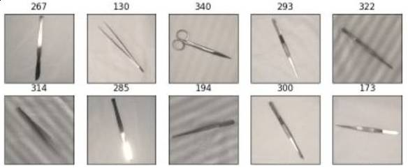
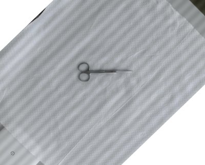
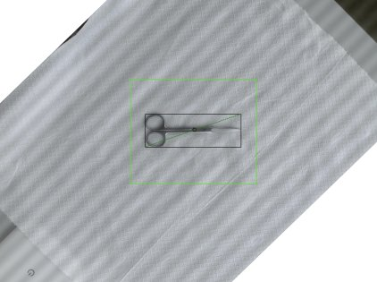
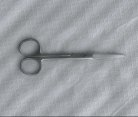
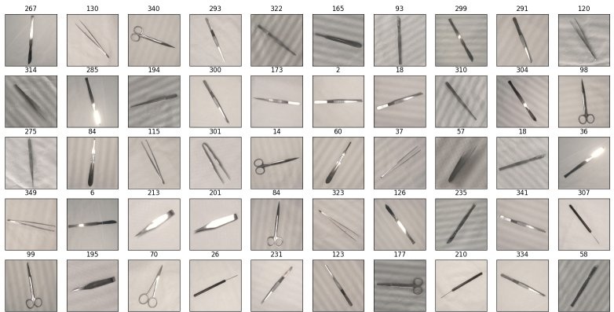
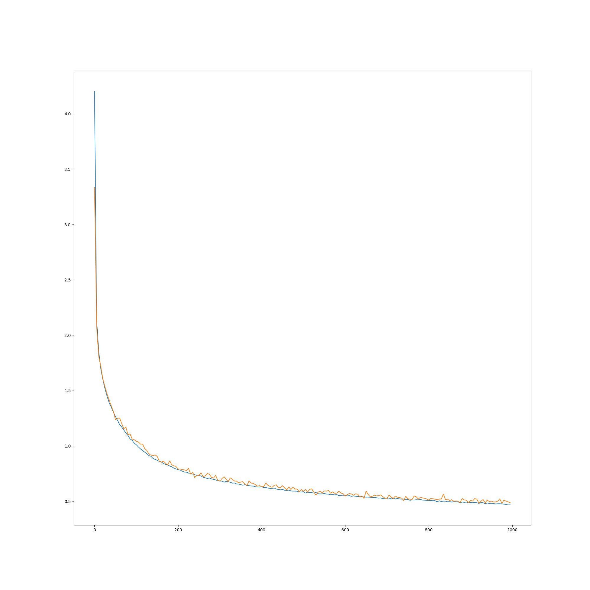
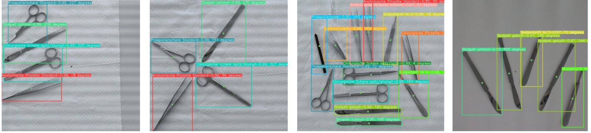

# Rona instrument orientation estimator
For picking objects from a surface by a robotic gripper not only the location of the object is important but also the orientation. 
In this project, we have trained a model to estimate the orientation of the surgical instruments. The model architecture is based on the modified [AlexNet model](https://papers.nips.cc/paper_files/paper/2012/file/c399862d3b9d6b76c8436e924a68c45b-Paper.pdf).
Our work is inspired by [RotNet](https://github.com/ZJCV/RotNet) but with some major changes in the model and augmentation methods. We have trained the model on our custom surgical instrument dataset including 12 different classes. 

Our trained model is trained to estimate the rotation angle of the surgical instruments in the range of 0-357 degrees with 1 degree precision. 358 and 359 degrees are not considered due to the fact that they are close to 360/0 degrees. It can bring confusion to the model in the training procedure especially that the dataset is manually aligned.

This repository is part of the [Rona](https://gitlab.intranet.doccheck.ag/rd/Robot-xArm-Development) project.  




# Meet Rona - your Open Source assistant for surgical procedures
Rona is an upgrade kit for robotic arms designed to address the problem with declining numbers of nurses in hospitals in
Germany, but also around the world. Rona's development is dedicated to create an affordable, easy to use, one-of-a-kind
software upgrade for surgery procedures and interventions where an additional hand is required, but a human support
might not be available.

The main GitHub repository for the Rona project: https://gitlab.intranet.doccheck.ag/rd/Robot-xArm-Development \
For further information visit also: https://more.doccheck.com/en/rona/ 
[](https://more.doccheck.com/en/rona/)


## Docker setup
We have created a Dockerfile to train/run the model in a container. 
``` 
make build
```

## Data collection
We have captured frames from different surgical instruments to train our model. We refer to our repository on [Rona surgical instrument detector](https://github.com/ZJCV/RotNet) on how to capture the frames.

We randomly selected 12 different surgical instruments from the [Rona Raw dataset with annotations](https://huggingface.co/DocCheck/Rona_captured_dataset_single_multi.zip) to prepare our training/testing dataset. To increase the diversity of the dataset, we chose different frames with various features like side lighting. 

Then, we rotated the frames in a way that all the instruments are laid in the same orientation with roughly zero degrees. One can use any image processing software/tool like in our case GNU Image Manipulation Program (GIMP) to rotate the frames.

## Data annotation
Annotating the collected dataset can be done by using any annotation tool which generates Yolo standard bounding box annotations.

As in Rona surgical instrument detector, we used [Yolo_Mark](https://github.com/AlexeyAB/Yolo_mark) tool.

After annotating the frames, structure the dataset(frames and annotations) as follows:
```
├── obj1
│   ├── obj1_01.png
│   ├── obj1_01.txt
│   ├── obj1_02.png
│   ├── obj1_02.txt
│   ├── ...
├── obj2
│   ├── obj2_01.png
│   ├── obj2_01.txt
│   ├── obj2_02.png
│   ├── obj2_02.txt
│   ├── ...
├── ...
```

# Preprocessing and data generator
Preprocessing pipeline is based on extracting and generating the dataset depending on the object's bounding box.  

Considering the object with the double sized bounding box, the diagonal of the new bounding box is calculated and added to some extra padding. Then the object is cropped based on the new size from its center point.

In this way, we can generate the dataset with different rotation angles regardless of any changes in the object's aspect ratio while calculating the rotation transform matrix.
It means that the object is located in the center point of the generated sample with enough padding to be rotated without loosing any borders specially for some degrees like 45, 135, 225, 315.

After rotating the object, the generated sample is resized to the desired size by adding borders to keep the aspect ratio.
Bellow is an illustration of how a sample object is cropped running the mentioned process.

|  |  |  |
|---------------------------------------------------------------|--------------------------------------------------------------------------|--------------------------------------------------------------------|
| Raw image                                                     | calculating the cropping region                                          | final cropped sample                                               |

Data generator creates the dataset as sample images and the labels in accordance with the rotated object and the rotation angle.
Here is an illustration of the generated samples from the raw frame.

|  |
|---------------------------------------------------------------|
| Generated samples with labels=angles in degrees               |

Our raw dataset is published on the [Huggingface](https://huggingface.co/DocCheck) platform.

[Rona orientation estimator dataset](https://huggingface.co/DocCheck/Rona_dataset_test.zip)

# Model architecture
We have modified the AlexNet model to better estimate the rotation angle of the surgical instruments. 
We considered the input images to be in grayscale in order to reduce the computational cost. Therefor, the input layer is only one chanel by the 128X128X1 size. To keep the model training well and capture the features, we reduced the padding size of the convolutional layers.
The output size is the number of rotation angles (358) with the softmax activation function.
You can find the model architecture in the `model.py` file.

# Data augmentation
The input image size is 128X128 pixels and is randomly cropped and rescaled from the 144X144 pixels images originated from the data generator.
To keep the model robust to the brightness and color perturbation, we have added a random jitter filter following by random noise and inverse filters to the input images as well.

# Train
We published our trained model on the [Huggingface](https://huggingface.co/DocCheck) platform.

[Rona surgical instrument orientation estimator model](https://huggingface.co/DocCheck/model_ori_est.zip) 

To train the model, you can run the following command inside the docker container with default settings.
``` 
make train-image
```
or alternatively to change the configurations,
``` 
python3 -m main --input-data "data/dataset/Orig_OPBesteck_dataset_rot_est_all/" --model-path "data/models/model_default/model_ori_est.pt" --n-class 357 --epochs 1000 train-model
```

|  |
|---------------------------------------------------------------------------------------------------|
| training(blue) and validation(orange) loss curves                                                 |


# Inference
To test the model, you can run the following command inside the docker container with the default settings.
``` 
make predict-image
```
or alternatively,
``` 
python3 -m main --input-data "data/dataset/Orig_OPBesteck_dataset_rot_est_all/" --model-path "data/models/model_default/model_ori_est.pt" --diff-t 3 predict-model
```
As a metric to evaluate our model, We considered a precise prediction if the difference between the predicted angle and the ground truth is less than 3 degrees.
We have reached a precision rate of around 97.0 % on the validation set which is a good result for our model.

Bellow is an illustration of the inference on the custom samples taken from the project.
The last number shows the predicted angle in degrees.

|  |
|-----------------------------------------------------------|
| Inference on the Rona test set                            |


 the README saying that development has slowed down or stopped completely. Someone may choose to fork your project or volunteer to step in as a maintainer or owner, allowing your project to keep going. You can also make an explicit request for maintainers.
 


# How To Get Involved
Do you want to support the development? We are always looking for new contributors and feedback.
### Bugs and issues
If you found an issue or have a feature request, please open an issue on the [issue tracker](https://gitlab.intranet.doccheck.ag/rd/Robot-xArm-Development/issues)

### Code contribution
If you want to contribute to the code by implementing new features or port the system to a different robotic arm, feel free to contribute to this project and the related repositories.

### Partnering up
If you want to partner up with us and continue the developing the Rona project with us, please contact us at: https://more.doccheck.com/en/rona/
